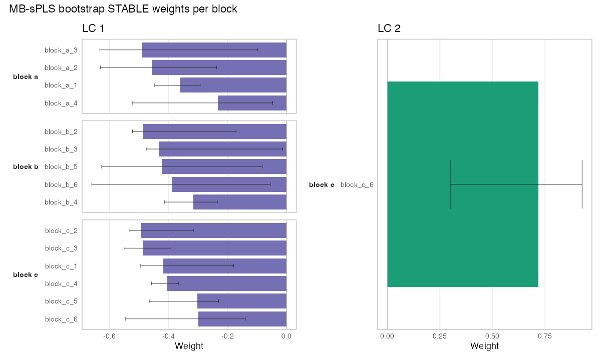
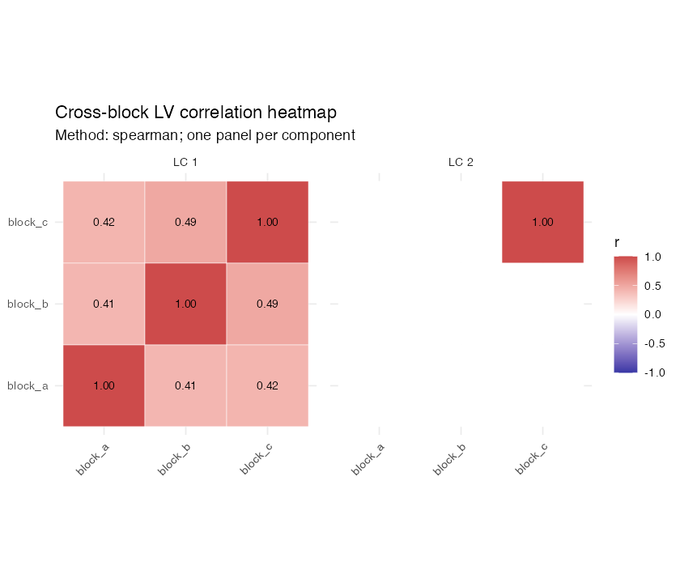

# mlr3mbspls: Multi-Block Sparse PLS for mlr3

<div align="center">

[](https://github.com/coorsaa/mlr3mbspls/actions/workflows/r-cmd-check.yml)
[](https://github.com/coorsaa/mlr3mbspls/actions/workflows/pkgdown.yml)

</div>

`mlr3mbspls` integrates **multi-block sparse partial least squares (MB-sPLS)** with the mlr3 ecosystem: pipelines, tuning, resampling, custom measures, rich visualisations, bootstrap stability selection, prediction‑side validation and nested CV utilities. A high‑performance C++/Armadillo backend powers the core algorithms (training + test EV, permutation, bootstrap, sparsity by block/component, deflation).

## Highlights

### Multi-Block Representation Learning
* Sequential orthogonal MB‑sPLS with per‑block L¹ sparsity (vector or full `c_matrix`)
* Two optimisation targets: mean absolute correlation (MAC) or Frobenius norm
* Training‑time permutation early stopping (per component)
* Prediction‑side validation: permutation or bootstrap inference on latent correlation
* Block‑wise explained variance (EV) + per‑component EV on train & test

### Pipeline Components (PipeOps)
* `PipeOpMBsPLS` – main transformer (produces per‑block latent scores `LVk_block`)
* `PipeOpMBsPLSBootstrapSelect` – post‑hoc bootstrap feature & component selection (CI or frequency method) with component re‑numbering
* `PipeOpMBsPCA` – multi‑block sparse PCA analogue
* `PipeOpMBsPLSXY` – supervised XY variant
* `PipeOpBlockScaling` – unit sum‑of‑squares or feature‑wise scaling / z‑scoring (optionally divide by √p)
* `PipeOpSiteCorrection` – multi‑block site/batch correction (methods defined per site variable)
* `PipeOpFeatureSuffix` – systematic feature renaming
* `PipeOpTargetLabelFilter` – target label filtering convenience op

### Learners & Imputation Helpers
* `LearnerClassifKNNGower`, `LearnerRegrKNNGower` – kNN using Gower distance for mixed types
* `impute_knn_graph()` – two‑step numeric/factor kNN imputation graph using above learners

### Tuning & Orchestration
* `TunerSeqMBsPLS`, `TunerSeqMBsPCA` – sequential component‑wise tuning (progressively add components)
* Sparse hyper‑parameters exposed with consistent `c_<block>` naming or full `c_matrix`

### Evaluation & Stability Tooling
* Measures: `MeasureMBsPLS_MAC`, `MeasureMBsPLS_EV`, `MeasureMBsPLS_BlockEV`, `MeasureMBsPLS_EVWeightedMAC`, `MeasureMBSPCAMEV`
* `compute_test_ev()`, `compute_pipeop_test_ev()` – EV + objective on new data
* `mbspls_flip_weights()` – deterministic reorientation (sign alignment)
* `mbspls_extract_bootstrap_means()` – summarise bootstrap runs
* `mbspls_plot_block_weight_ci()` – block weight CIs
* Aggregation helpers: `aggregate_mbspls_payloads()`, `collect_mbspls_nested_cv()`

### Higher Level Graph Utilities
* `mbspls_preproc_graph()` – canonical preprocessing (type conversion → encoding → kNN impute → site correction → scaling)
* `mbspls_graph_learner()` – end‑to‑end GraphLearner constructor (preproc → MB‑sPLS → optional bootstrap selection → downstream learner)
* `mbsplsxy_graph()` / `mbsplsxy_graph_learner()` – supervised MB‑sPLS‑XY graph constructors for classification and regression

### Resampling & Batch Infrastructure
* `mbspls_nested_cv()` – nested CV (inner tuning budget + outer evaluation)
* `mbspls_nested_cv_batchtools()` – batchtools backend variant

### Visualisation (S3 Autoplot on `GraphLearner`)
Types include: weights (raw / stability‑filtered), variance, scree, correlation heatmap, network, scores, block EV trajectories, bootstrap diagnostics.


## Installation

```r
# Development version
devtools::install_github("coorsaa/mlr3mbspls")

# Core dependencies (install if missing)
install.packages(c("mlr3","mlr3pipelines","mlr3cluster","data.table","ggplot2"))
```

Optional: network plots require `igraph` + `ggraph`.

## TaskMultiBlock with breast.TCGA and potato

Use the dataset adapters to obtain ready-to-use multi-block tasks.

```r
# breast.TCGA adapter
if (requireNamespace("mixOmics", quietly = TRUE)) {
  task_tcga = task_multiblock_breast_tcga(task_type = "classif")
  task_tcga$block_names
}

# potato adapter
if (requireNamespace("multiblock", quietly = TRUE)) {
  task_potato = task_multiblock_potato(task_type = "regr", response = 1L)
  task_potato$block_names
}
```

## Supervised Quick Start (MB-sPLS-XY)

Packaged classification and regression toy tasks are also available and work with the supervised graph constructors.

```r
# classification
task_cls = tsk("mbspls_synthetic_classif")
gl_cls = mbsplsxy_graph_learner(
  task = task_cls,
  learner = lrn("classif.featureless"),
  ncomp = 2L
)

# regression
task_regr = tsk("mbspls_synthetic_regr")
gl_regr = mbsplsxy_graph_learner(
  task = task_regr,
  learner = lrn("regr.featureless"),
  ncomp = 2L
)
```

## Quick Start (Unsupervised Multi-Block Sparse Partial Least Squares)

The example below uses the packaged task `mbspls_synthetic_blocks` and follows a script-like, inspectable sequence.

### Step 0: Setup

Load packages and define compact runtime settings. These defaults are intentionally small for a quick demonstration. Increase them for full analyses.

```r
library(mlr3)
library(mlr3pipelines)
library(mlr3tuning)
library(mlr3cluster)
library(mlr3learners)
library(mlr3mbspls)
library(data.table)

set.seed(42)

cfg = list(
  ncomp = 3L,
  centers = 2L,
  inner_folds = 3L,
  outer_folds = 3L,
  tuner_budget = 40L,
  n_perm = 40L,
  n_perm_tuning = 40L,
  val_test_n = 40L,
  bootstrap_B = 40L,
  frequency_threshold = 0.5,
  perf_metric = "mac"
)
```

### Step 1: Load Packaged Task

Load the packaged synthetic multi-block task, inspect its backend, and reuse the task-level block metadata directly.

```r
task_source = tsk("mbspls_synthetic_blocks")
dt_demo = as.data.table(task_source$data(cols = task_source$feature_names))
blocks = task_source$block_features()
```

### Step 2: Define Site Correction

The block mapping already lives on the task. Site correction is declared per block so adjustments stay explicit.

```r
site_correction = list(block_a = "site_batch", block_b = "site_batch", block_c = "site_batch")
site_correction_methods = list(block_a = "partial_corr", block_b = "partial_corr", block_c = "partial_corr")
```

### Step 3: Clone the Analysis Task

The packaged task is already a `TaskMultiBlock`, so for analysis you can usually just clone it.

```r
task_train = TaskMultiBlock(
  task_source,
  id = "mbspls_synthetic_blocks_analysis"
)
```

### Step 4: Build Nested-CV Learner

For nested CV and tuning, bootstrap selection is disabled intentionally. This keeps evaluation focused on core model generalization.

```r
gl_nested = ppl(
  "mbspls_graph_learner",
  learner = lrn("clust.kmeans", centers = cfg$centers),
  task = task_train,
  site_correction = site_correction,
  site_correction_methods = site_correction_methods,
  ncomp = cfg$ncomp,
  performance_metric = cfg$perf_metric,
  permutation_test = TRUE,
  n_perm = cfg$n_perm,
  bootstrap = FALSE,
  bootstrap_selection = FALSE,
  B = 1L,
  val_test = "permutation",
  val_test_n = cfg$val_test_n
)

rs_outer = rsmp("cv", folds = cfg$outer_folds)
rs_inner = rsmp("cv", folds = cfg$inner_folds)
rs_outer$instantiate(task_train)
```

### Step 5: Run Nested CV

This is the primary inferential validation stage.

```r
res_nested = mbspls_nested_cv(
  task = task_train,
  graphlearner = gl_nested,
  rs_outer = rs_outer,
  rs_inner = rs_inner,
  ncomp = cfg$ncomp,
  tuner_budget = cfg$tuner_budget,
  tuning_early_stop = TRUE,
  performance_metric = cfg$perf_metric,
  val_test = "permutation",
  val_test_n = cfg$val_test_n,
  n_perm_tuning = cfg$n_perm_tuning,
  store_payload = TRUE
)

res_nested$summary_table
```

### Step 6: Retune on Full Training Data

Retune `c_matrix` on all rows after nested validation. This final matrix is reused across final mode fits.

```r
gl_tune = ppl(
  "mbspls_graph_learner",
  learner = lrn("clust.kmeans", centers = cfg$centers),
  task = task_train,
  site_correction = site_correction,
  site_correction_methods = site_correction_methods,
  ncomp = cfg$ncomp,
  performance_metric = cfg$perf_metric,
  permutation_test = TRUE,
  n_perm = cfg$n_perm,
  bootstrap = FALSE,
  bootstrap_selection = FALSE,
  B = 1L,
  val_test = "none"
)

tuner = TunerSeqMBsPLS$new(
  tuner = "random_search",
  budget = cfg$tuner_budget,
  resampling = rsmp("cv", folds = cfg$inner_folds),
  parallel = "none",
  early_stopping = TRUE,
  n_perm = cfg$n_perm_tuning,
  performance_metric = cfg$perf_metric
)

instance = ti(
  task = task_train,
  learner = gl_tune,
  resampling = rsmp("insample"),
  measure = msr("mbspls.mac_evwt"),
  terminator = trm("evals", n_evals = 1)
)

tuner$optimize(instance)
c_matrix_final = instance$result$learner_param_vals[[1]]$c_matrix
c_matrix_final
```

### Step 7: Final Fits by Mode

Train three final modes:

- `raw`: no stability filter
- `stable_ci`: CI-filtered stability
- `stable_frequency`: frequency-filtered stability

Bootstrap selection is enabled only at this stage.

```r
out_dir = file.path("analysis_results", paste0(format(Sys.time(), "%Y%m%d_%H%M%S"), "_MBSPLS_SYNTHETIC_BLOCKS"))
dir.create(out_dir, recursive = TRUE, showWarnings = FALSE)

modes = list(
  raw = list(selection = "none", predict_weights = "raw"),
  stable_ci = list(selection = "ci", predict_weights = "stable_ci"),
  stable_frequency = list(selection = "frequency", predict_weights = "stable_frequency")
)

for (mode_name in names(modes)) {
  mode_spec = modes[[mode_name]]

  gl_final = ppl(
    "mbspls_graph_learner",
    learner = lrn("clust.kmeans", centers = cfg$centers),
    blocks = blocks,
    site_correction = site_correction,
    site_correction_methods = site_correction_methods,
    ncomp = cfg$ncomp,
    performance_metric = cfg$perf_metric,
    permutation_test = TRUE,
    n_perm = cfg$n_perm,
    bootstrap = TRUE,
    bootstrap_selection = mode_spec$selection != "none",
    selection_method = if (mode_spec$selection == "frequency") "frequency" else "ci",
    frequency_threshold = cfg$frequency_threshold,
    B = cfg$bootstrap_B,
    val_test = "none"
  )

  gl_final$param_set$values$mbspls.c_matrix = c_matrix_final
  if (!is.null(gl_final$graph$pipeops$mbspls)) {
    gl_final$graph$pipeops$mbspls$param_set$values$c_matrix = c_matrix_final
    gl_final$graph$pipeops$mbspls$param_set$values$predict_weights = mode_spec$predict_weights
    gl_final$graph$pipeops$mbspls$param_set$values$store_train_blocks = TRUE
  }

  gl_final$train(task_train)
  pred_train = gl_final$predict(task_train)
  po_state = gl_final$model$mbspls

  mode_dir = file.path(out_dir, mode_name)
  dir.create(mode_dir, recursive = TRUE, showWarnings = FALSE)

  fwrite(data.table(row_id = pred_train$row_ids, cluster = as.character(pred_train$partition)),
         file.path(mode_dir, "clusters_train.csv"))
  saveRDS(gl_final, file.path(mode_dir, "graphlearner.rds"))
  saveRDS(po_state, file.path(mode_dir, "train_state.rds"))
}
```

### Step 8: Save Core Outputs

Persist nested CV summaries and payloads for reporting and reproducibility.

```r
fwrite(as.data.table(res_nested$summary_table), file.path(out_dir, "nested_cv_summary.csv"))
saveRDS(res_nested, file.path(out_dir, "nested_cv_object.rds"))
```


## Prediction-Side Validation & Bootstrap Selection

```r
# Optional: parallel bootstrap selection (cross-platform) via future
# install.packages(c("future", "future.apply"))
if (requireNamespace("future", quietly = TRUE)) {
  future::plan(future::multisession, workers = 4)
  # future::plan(future::sequential)  # reset when done
}

log_env = new.env(parent = emptyenv())

graph_sel = po("blockscale", param_vals = list(blocks = blocks)) %>>%
  po("mbspls", blocks = blocks, ncomp = 4L, performance_metric = "mac",
     permutation_test = TRUE, n_perm = 200L, perm_alpha = 0.05,
     val_test = "permutation", val_test_n = 500L, val_test_alpha = 0.05,
     append = TRUE,               # expose upstream LV columns to selection op
     store_train_blocks = TRUE,   # pass original blocks for bootstrap
     log_env = log_env) %>>%
  po("mbspls_bootstrap_select", log_env = log_env, bootstrap = TRUE,
     B = 200L, selection_method = "ci", align = "block_sign",
     workers = 4L) %>>%
  po("learner", learner = lrn("clust.kmeans", centers = 3))

gl_sel = as_learner(graph_sel)
gl_sel$train(task)

# Stable (post-selection) latent columns now in the task representation
gl_sel$model$mbspls_bootstrap_select$kept_blocks_per_comp
```


## Higher Level Convenience Graph

```r
# --- Site / batch effect correction example ---
# PipeOpSiteCorrection supports per-block methods: "partial_corr", "combat", "dir".
# For "combat" supply a list with elements site=<char1>, covariates=<char_vec>.
# For "partial_corr" supply a character vector of (site + optional covariates) columns.

# Add mock site / batch / covariate columns to the data (if not already present)
dt[, site  := sample(c("S1","S2","S3"), .N, TRUE)]
dt[, batch := sample(c("B1","B2"),   .N, TRUE)]
dt[, age   := rnorm(.N, 50, 8)]
dt[, sex   := sample(c("F","M"), .N, TRUE)]

# Update task backend to include new columns
task = TaskClust$new("mb", backend = dt)
task$select(setdiff(task$feature_names, "id"))

# Per-block site correction specifications
site_correction = list(
  clinical = list(site = "site", covariates = c("age","sex")), # ComBat with covariates
  genomics = c("batch"),                                          # partial correlation on batch
  metabol  = "site"                                               # single categorical site (partial_corr)
)

# Corresponding methods per block
site_correction_methods = list(
  clinical = "combat",
  genomics = "partial_corr",
  metabol  = "partial_corr"
)

# Optional: use future for parallel bootstrap stability selection
# future::plan(future::multisession, workers = 4)

gl_full = mbspls_graph_learner(
  blocks = blocks,
  site_correction = site_correction,
  site_correction_methods = site_correction_methods,
  keep_site_col = FALSE,      # drop site / covariate columns after correction
  ncomp = 3L,
  performance_metric = "mac",
  permutation_test = TRUE,
  n_perm = 200L,
  bootstrap = TRUE,
  B = 100L,
  workers = 4L,
  selection_method = "frequency",
  frequency_threshold = 0.1
)

gl_full$train(task)
```


## Visualisation Examples

### Example Plots

The README includes two representative MB-sPLS plots generated from the packaged synthetic task.

**Block weights (bootstrap-stable)**



**Latent correlation heatmap (Spearman)**



Reproduce these plots with:

```r
task_plot = tsk("mbspls_synthetic_blocks")
site_correction = list(block_a = "site_batch", block_b = "site_batch", block_c = "site_batch")
site_methods = list(block_a = "partial_corr", block_b = "partial_corr", block_c = "partial_corr")

gl_plot = mbspls_graph_learner(
  task = task_plot,
  learner = lrn("clust.kmeans", centers = 2L),
  site_correction = site_correction,
  site_correction_methods = site_methods,
  ncomp = 2L,
  c_matrix = matrix(3, nrow = 3L, ncol = 2L),
  performance_metric = "mac",
  permutation_test = FALSE,
  bootstrap = TRUE,
  bootstrap_selection = TRUE,
  selection_method = "ci",
  B = 20L,
  val_test = "none"
)

gl_plot$train(task_plot)

autoplot(gl_plot, type = "mbspls_weights", source = "bootstrap", top_n = 12)
autoplot(gl_plot, type = "mbspls_heatmap", method = "spearman", absolute = FALSE)
```

```r
library(mlr3viz)
autoplot(gl_sel, type = "mbspls_weights", source = "weights", top_n = 10)
autoplot(gl_sel, type = "mbspls_weights", source = "bootstrap", alpha_by_stability = TRUE)
autoplot(gl_sel, type = "mbspls_variance", show_total = TRUE)
autoplot(gl_sel, type = "mbspls_heatmap", method = "spearman", absolute = FALSE)
# Optional network (needs igraph/ggraph installed)
# autoplot(gl_sel, type = "mbspls_network", cutoff = 0.1)
```

`mbspls_plot_block_weight_ci()` produces per‑block weight confidence intervals after bootstrap selection:

```r
mbspls_plot_block_weight_ci(gl_sel, source = "bootstrap", alpha_by_stability = TRUE)
```

| Measure Class | Purpose |
| ------------- | ------- |
| `MeasureMBsPLS_MAC` | Mean absolute correlation of block scores |
| `MeasureMBsPLS_EV` | Mean prediction-side explained variance across components |
| `MeasureMBsPLS_BlockEV` | Mean prediction-side block EV across components and blocks |
| `MeasureMBsPLS_EVWeightedMAC` | MAC weighted by EV contribution |
| `MeasureMBSPCAMEV` | EV (multi‑block sparse PCA) |

Use like any mlr3 measure:

```r
ms = list(msr("mbspls.mac"), msr("mbspls.ev"))
rr = resample(task, gl, rsmp("cv", folds = 3), store_models = TRUE)
rr$score(ms)
rr$aggregate(ms)
```


## Nested Cross-Validation

```r
library(mlr3tuning)
res_nested = mbspls_nested_cv(
  task = task,
  graphlearner = gl_full,
  rs_outer = rsmp("cv", folds = 3),
  rs_inner = rsmp("cv", folds = 2),
  ncomp = 4L,
  tuner_budget = 10L,
  performance_metric = "mac"
)
str(res_nested)
```

Batchtools version (for HPC) is available via `mbspls_nested_cv_batchtools()`.


## Sequential Component Tuning

```r
tuner = TunerSeqMBsPLS$new()
instance = ti(
  task = task,
  learner = gl_full,
  resampling = rsmp("cv", folds = 2),
  measure = msr("mbspls.mac"),
  terminator = trm("evals", n_evals = 20)
)
# tuner$optimize(instance)
# instance$result$learner_param_vals[[1]]$c_matrix
```


## Useful Low-Level Helpers

| Function | Role |
| -------- | ---- |
| `compute_test_ev()` | Compute EV + objective on new matrices (standalone) |
| `compute_pipeop_test_ev()` | Same for a PipeOp state representation |
| `mbspls_eval_new_data()` | Score new data given training state (matrix interface) |
| `mbspls_flip_weights()` | Sign alignment (GraphLearner, PipeOp, list) |
| `mbspls_extract_bootstrap_means()` | Summarise bootstrap weight means |
| `aggregate_mbspls_payloads()` | Merge logged payloads (e.g. across resamples) |
| `collect_mbspls_nested_cv()` | Collect nested CV payload archives |


## Custom Learners (Gower kNN)

```r
knn_cls = lrn("classif.knngower", k = 5)
knn_reg = lrn("regr.knngower", k = 5)
```

These are used implicitly inside `impute_knn_graph()` and can be part of supervised pipelines downstream of MB‑sPLS/MB‑sPCA representations.


## Reproducible Sparsity Specification

Two options:

1. Per‑block constraints automatically created: parameters named `c_<block>` with default upper bound √p.
2. Provide a `c_matrix` (rows = blocks, cols = components) – overrides `ncomp` and per‑block `c_` values.

```r
graph_cmat = po("mbspls", blocks = blocks, c_matrix = matrix(c(2,2,3,3,1,1), nrow = 3, byrow = TRUE))
```


## Vignette

See the Quickstart vignette for an end‑to‑end multi‑omics example:

```r
vignette("quickstart", package = "mlr3mbspls")
```


## Citation

If you use `mlr3mbspls` in academic work please cite:

```
@Manual{mlr3mbspls,
  title = {mlr3mbspls: Multi-Block Sparse PLS for mlr3},
  author = {Stefan Coors and Clara Sophie Vetter},
  year = {2025},
  note = {R package version 0.2.14},
  url = {https://github.com/coorsaa/mlr3mbspls}
}
```


## Contributing

Issues & PRs welcome. Please open an issue for substantial interface changes before implementing. Run `pre-commit` hooks + `R CMD check` locally.


## License

LGPL-3
