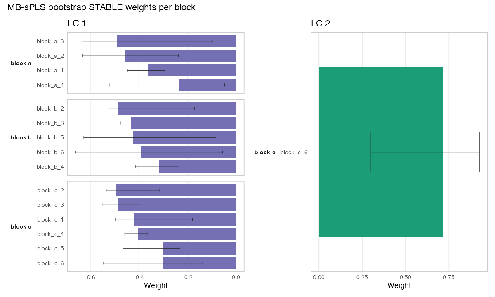
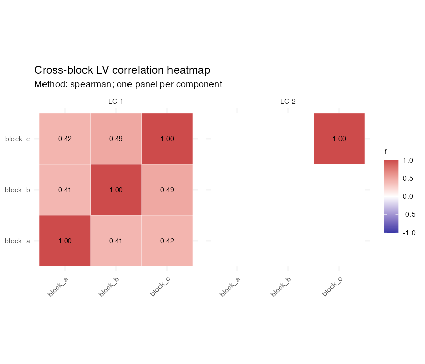

# mlr3mbspls: Multi-Block Sparse PLS for mlr3

<div align="center">

[](https://github.com/coorsaa/mlr3mbspls/actions/workflows/r-cmd-check.yml)
[](https://github.com/coorsaa/mlr3mbspls/actions/workflows/pkgdown.yml)

</div>

`mlr3mbspls` integrates multi-block sparse partial least squares (MB-sPLS)
with the `mlr3` ecosystem. It provides unsupervised and supervised graph
pipelines, block-aware tasks, nested resampling, descriptive bootstrap
stability, model summaries, visualisations, and a native C++/Armadillo backend.

Development version: **0.4.0**

## Inference boundary

Ordinary bootstrap output describes uncertainty and stability; it is not an
automatic null-hypothesis test. The package provides three deliberately scoped
permutation interfaces:

- `mb_permutation_test()` reruns a complete user-supplied analysis for every
  design-valid shuffle.
- `mbspls_permutation_test()` refits a fixed, pre-specified MB-sPLS analysis and
  returns one global block- or target-association p-value.
- `mb_lc_confirmation_test()` tests pre-specified frozen LC score associations
  in genuinely untouched confirmation observations and applies Holm correction
  across the supplied LC family.

None of these functions turns later components into a generic population-rank
test. Exchangeability units, strata, nuisance-variable handling, and the
scientific null remain study-design responsibilities. Read the
[statistical-validity contract](inst/STATISTICAL_VALIDITY.md) before reporting
significance.

## Main capabilities

- `TaskMultiBlock()` and packaged synthetic classification, regression, and
  clustering tasks with persistent block metadata.
- `PipeOpMBsPLS`, `PipeOpMBsPLSXY`, and `PipeOpMBsPCA` for sparse multiblock
  representation learning.
- Training-fitted block scaling, site/batch correction, feature suffixing, and
  target-label filtering.
- Sequential component-wise tuning and direct or `batchtools`-backed nested
  cross-validation.
- Group-aware bootstrap sampling, deterministic L'Ecuyer-CMRG streams, sign
  alignment, and schema-safe frozen scaling helpers.
- Tidy task/model summaries and plots for weights, stability intervals,
  explained variance, scores, correlations, and networks.

## Installation

```r no-eval
install.packages(c(
  "mlr3",
  "mlr3pipelines",
  "mlr3cluster",
  "mlr3tuning",
  "data.table",
  "ggplot2"
))
install.packages("remotes")

remotes::install_github("coorsaa/mlr3mbspls")
```

Optional dataset adapters and plots use packages listed in `Suggests`, including
`mixOmics`, `multiblock`, `igraph`, and `ggraph`.

## Executable quickstart

This example loads the packaged clustering task, inspects its block structure,
fits a two-component graph, predicts the training rows, and produces two plots.
The complete executable analysis, including nested validation and bootstrap
stability, is in the quickstart vignette.

```r
suppressPackageStartupMessages({
  library(mlr3)
  library(mlr3cluster)
  library(mlr3mbspls)
  library(ggplot2)
})

lgr::lgr$set_threshold("warn")
lgr::get_logger("mlr3")$set_threshold("warn")

task = tsk("mbspls_synthetic_blocks")
blocks = task$block_features()
quality = task$overview()

quality$overview
quality$blocks
lengths(blocks)

site_correction = list(
  block_a = "site_batch",
  block_b = "site_batch",
  block_c = "site_batch"
)
site_methods = list(
  block_a = "partial_corr",
  block_b = "partial_corr",
  block_c = "partial_corr"
)

learner = mbspls_graph_learner(
  learner = lrn("clust.kmeans", centers = 2L),
  task = task,
  site_correction = site_correction,
  site_correction_methods = site_methods,
  ncomp = 2L,
  performance_metric = "mac",
  permutation_test = FALSE,
  bootstrap = FALSE,
  store_train_blocks = TRUE,
  bootstrap_selection = FALSE,
  B = 1L,
  val_test = "none"
)

learner$train(task)
prediction = learner$predict(task)
report = mbspls_model_summary(learner)

table(prediction$partition)
report$overview
report$components
report$blocks

weight_plot = autoplot(
  learner,
  type = "mbspls_weights",
  source = "weights",
  top_n = 8L
)
variance_plot = autoplot(
  learner,
  type = "mbspls_variance",
  source = "weights",
  show_total = TRUE
)

weight_plot
variance_plot
```

Representative rendered output from the bootstrap-stability workflow:





## Proper omnibus permutation inference

For a fixed analysis, `mbspls_permutation_test()` standardises and refits every
permuted dataset. Sampled p-values use inclusive ties and
`(b + 1) / (B + 1)`, so they cannot be zero.

```r
suppressPackageStartupMessages(library(mlr3mbspls))

set.seed(20260831L)
n = 48L
latent = stats::rnorm(n)
raw_numeric_blocks = list(
  clinical = cbind(
    marker = latent + stats::rnorm(n, sd = 0.25),
    noise = stats::rnorm(n)
  ),
  imaging = cbind(
    region = latent + stats::rnorm(n, sd = 0.25),
    noise = stats::rnorm(n)
  )
)

global_test = mbspls_permutation_test(
  blocks = raw_numeric_blocks,
  statistic = "global_lc1",
  n_perm = 99L,
  seed = 20260831L,
  analysis_seed = 11L
)

global_test
global_test$p_value
```

If imputation, filtering, tuning, sparsity, or component count was selected
from the tested alignment, put the complete procedure inside an
`mb_permutation_test()` callback so every selection step is repeated. Use
`exchangeability_unit`, `within_unit`, and `strata` whenever row-wise shuffling
is not justified.

## LC-specific confirmation inference

LC-specific p-values require a truly independent confirmation cohort. The
complete score transformation and the LC family must have been frozen before
those observations were examined. The data below are generated independently
of the preceding example by construction.

```r
suppressPackageStartupMessages(library(mlr3mbspls))

set.seed(20260901L)
n_confirmation = 80L
confirmation_signal = stats::rnorm(n_confirmation)
confirmation_scores = list(
  predictor = cbind(
    LC1 = confirmation_signal + stats::rnorm(n_confirmation, sd = 0.08),
    LC2 = stats::rnorm(n_confirmation)
  ),
  outcome = cbind(
    LC1 = confirmation_signal + stats::rnorm(n_confirmation, sd = 0.08),
    LC2 = stats::rnorm(n_confirmation)
  )
)

confirmed = mb_lc_confirmation_test(
  scores = confirmation_scores,
  independent_confirmation = TRUE,
  permute_blocks = "outcome",
  n_perm = 99L,
  seed = 20260831L
)

confirmed
confirmed$results
```

The Holm-adjusted results concern replication of fixed score associations. They
do not establish that the population cross-block rank is at least two.

## Descriptive bootstrap uncertainty

```r
suppressPackageStartupMessages(library(mlr3mbspls))

set.seed(20260831L)
x = stats::rnorm(80L)
y = 0.6 * x + stats::rnorm(80L, sd = 0.7)
observed = stats::cor(x, y)
replicates = replicate(199L, {
  rows = sample.int(length(x), replace = TRUE)
  stats::cor(x[rows], y[rows])
})

uncertainty = mb_bootstrap_summary(
  replicates = replicates,
  observed = observed,
  conf = 0.95,
  type = "percentile"
)

uncertainty
stopifnot(is.na(uncertainty$p_value))
```

## Supervised MB-sPLS-XY

```r
suppressPackageStartupMessages({
  library(mlr3)
  library(mlr3mbspls)
})

classification_task = tsk("mbspls_synthetic_classif")
classification_learner = mbsplsxy_graph_learner(
  task = classification_task,
  learner = lrn("classif.featureless"),
  ncomp = 1L
)
classification_learner$train(classification_task)
classification_prediction = classification_learner$predict(
  classification_task
)

regression_task = tsk("mbspls_synthetic_regr")
regression_learner = mbsplsxy_graph_learner(
  task = regression_task,
  learner = lrn("regr.featureless"),
  ncomp = 1L
)
regression_learner$train(regression_task)
regression_prediction = regression_learner$predict(regression_task)

classification_prediction
regression_prediction
```

## Documentation and complete workflow

- [Quickstart vignette](vignettes/quickstart.Rmd): every supported inference
  route, nested CV, final models, displayed output, and plots; no analysis
  results are written to the working directory.
- [Statistical-validity contract](inst/STATISTICAL_VALIDITY.md): leakage,
  exchangeability, nested tuning, metrics, and interpretation.
- [Reproducibility protocol](inst/REPRODUCIBILITY.md): seeds, RNG streams,
  release evidence, and reporting requirements.
- [Clinical model card](inst/MODEL_CARD.md): study-specific psychiatry and
  precision-medicine obligations.

To install and open the rendered vignette, also install `knitr` and `rmarkdown`
and build vignettes during installation (a Pandoc installation is required):

```r no-eval
install.packages(c("knitr", "rmarkdown"))
remotes::install_github("coorsaa/mlr3mbspls", build_vignettes = TRUE)
vignette("quickstart", package = "mlr3mbspls")
```

## Selected API

| Function | Role |
| --- | --- |
| `TaskMultiBlock()` | Create a task with persistent block membership |
| `mb_task_overview()` | Audit block size, missingness, constants, and target balance |
| `mbspls_graph_learner()` | Build an unsupervised MB-sPLS graph learner |
| `mbsplsxy_graph_learner()` | Build a supervised MB-sPLS-XY graph learner |
| `mbspls_nested_cv()` | Run sequential tuning inside outer validation |
| `mbspls_model_summary()` | Extract tidy fitted-model summaries |
| `mb_permutation_test()` | Rerun one complete analysis under valid shuffles |
| `mbspls_permutation_test()` | Run a fixed-specification omnibus MB-sPLS test |
| `mb_lc_confirmation_test()` | Test frozen LCs in independent confirmation data |
| `mb_bootstrap_summary()` | Summarise descriptive bootstrap uncertainty |
| `mbspls_plot_block_weight_ci()` | Plot sign-aligned bootstrap stability intervals |

## Citation

If you use `mlr3mbspls` in academic work, cite:

```text
Coors S, Vetter CS (2026). mlr3mbspls: Multi-Block Sparse Partial Least
Squares for mlr3. R package version 0.4.0.
https://github.com/coorsaa/mlr3mbspls
```

## Contributing

All R code, examples, vignettes, and R fences in Markdown follow the pinned
`styler.mlr` guide. See [CONTRIBUTING.md](CONTRIBUTING.md) and run:

```sh
Rscript tools/style.R
Rscript tools/style.R --check
```

## License

LGPL-3
